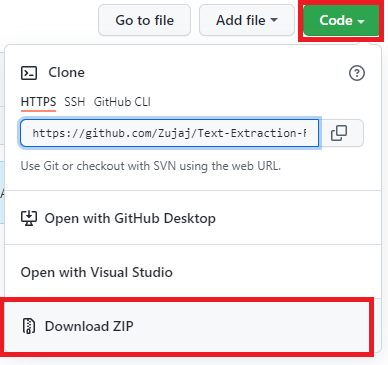
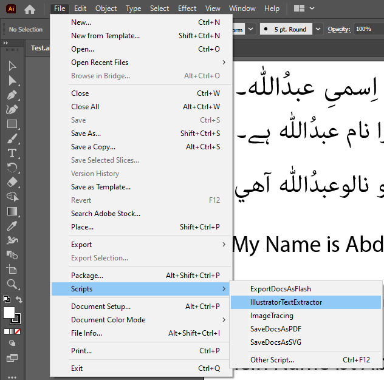
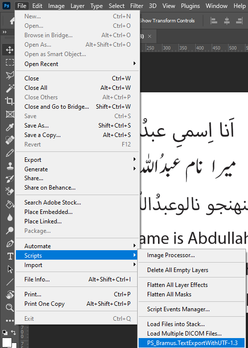
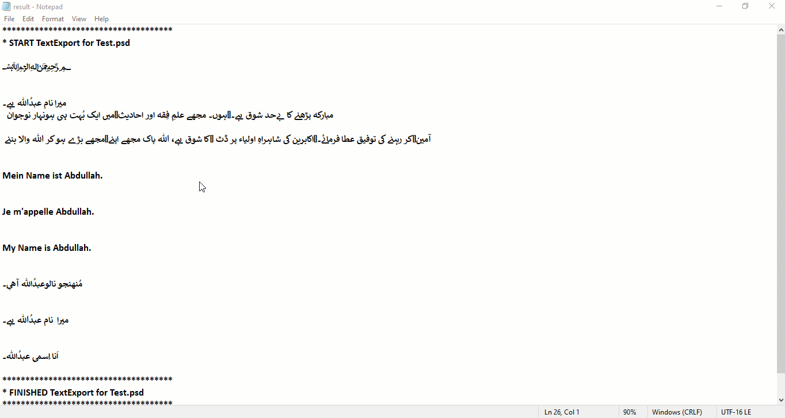
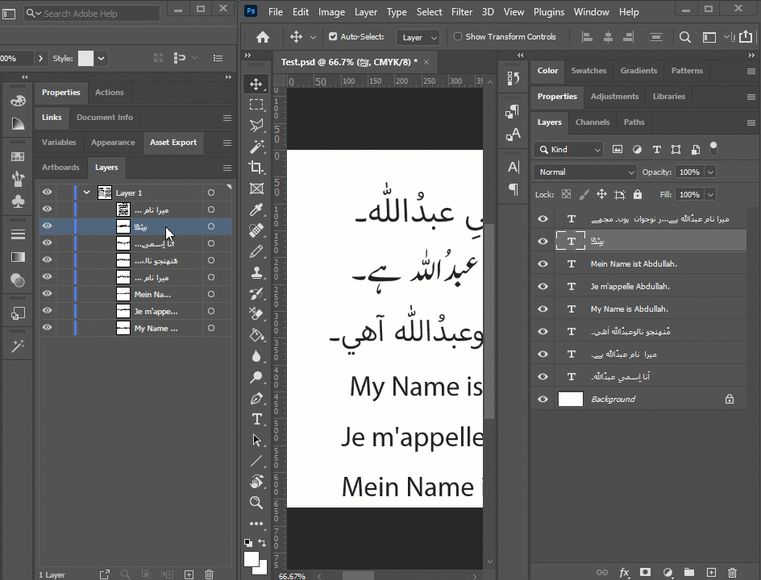
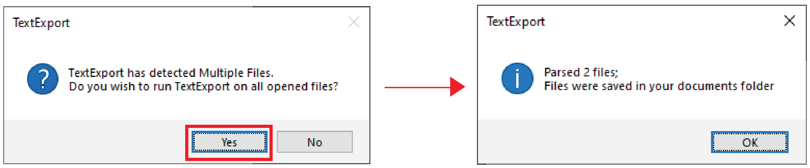

# Text Extraction From Adobe Illustrator & Photoshop To Notepad


Code Scripts to export text from Adobe Illustrator & Photoshop into Notepad.

## The Problem

As a **graphic designer**, during extensive typing work, there comes a time when you want to copy-paste a large pile of text from the layers or artboard. So you might wonder how would you:

⌨️ Keep yourself relaxed while typing?

📝 Extract out all the text within just a few clicks?

🗒️ Automatically save the extracted text in a notepad file?

To get into more details, read [this medium article](https://levelup.gitconnected.com/how-to-export-text-from-adobe-illustrator-and-photoshop-to-notepad-95da5d2bea15).

## The Solution

Download this repository as a `ZIP` file and follow the below steps.

   

### Exporting Text in Adobe Illustrator

1. Close `Illustrator` and extract the `IllustratorTextExtractor.jsx` file inside the `Scripts` folder.

    `C:\Program Files\Adobe\Adobe Illustrator 2021\Presets\en_US\Scripts`

2. Open up the `Test.ai` file and navigate to `File/Scripts` to execute the script.

    
  
### Exporting Text in Adobe Photoshop

1. Close `Photoshop` and extract the `PS_Bramus.TextExportWithUTF-1.3.jsx` file inside the `Scripts` folder.

    `C:\Program Files\Adobe\Adobe Photoshop 2021\Presets\Scripts`

2. Open up the `Test.psd` file and navigate to `File/Scripts` to execute the script.

    

## Result

After a successful export, your text would pop up in **Notepad**. Change the text alignment from left to right to view the Urdu text correctly.



## Fun Facts

Below are some interesting facts that you can try out.

1. To change the order of the text, switch the layer order.

    

2. Open up multiple files & export them within a single click shown in the below image.

    

3. Run the scripts with other languages by changing the file encoding; refer to the below snippet.

```jsx
fileOut.encoding = "UTF-16"; // Change it to UTF-8 or UTF-32
```

## Acknowledgment

Thanks to [Bramus](https://www.bram.us/2008/10/30/ps_bramustextconvert-psd2txt-and-txt2psd-for-the-masses/) for sharing the script code on [GitHub](https://github.com/bramus/PS_BRAMUS.TextConvert).

## Contribution

Feel free to contribute to this repository by submitting a [pull request](.github/pull_request_template.md) or opening an issue. Your contributions are welcome!
